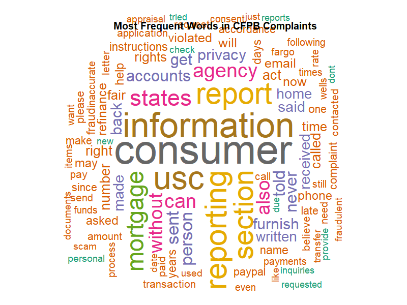
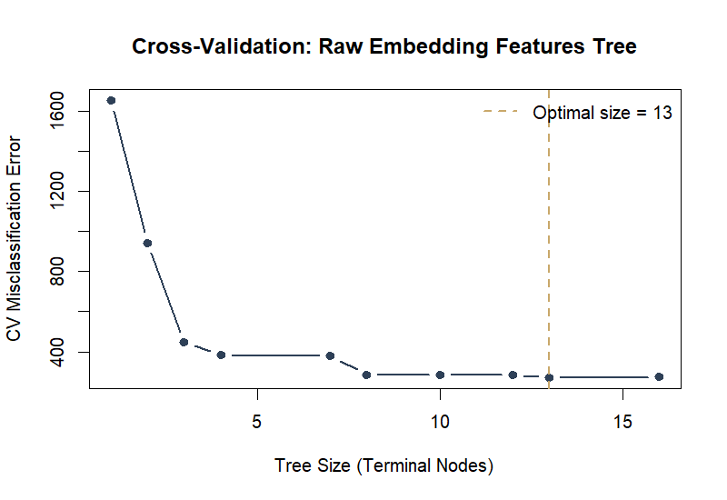
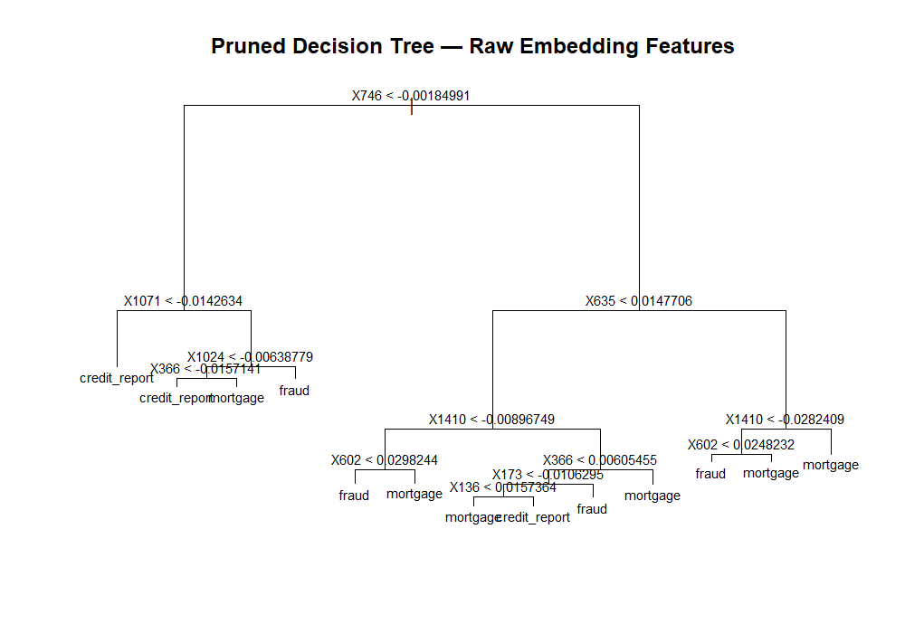
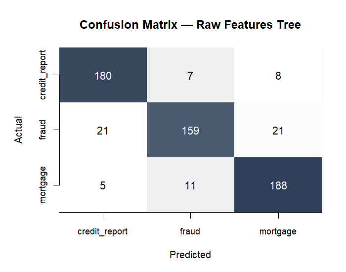
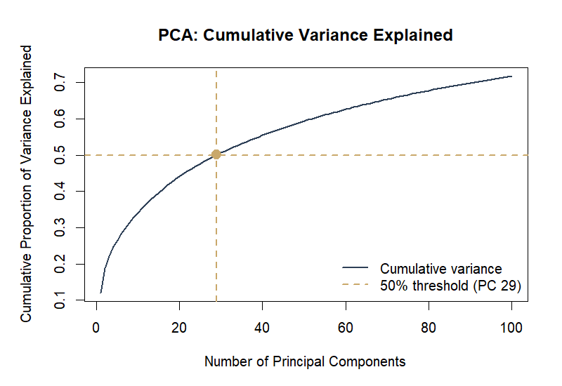
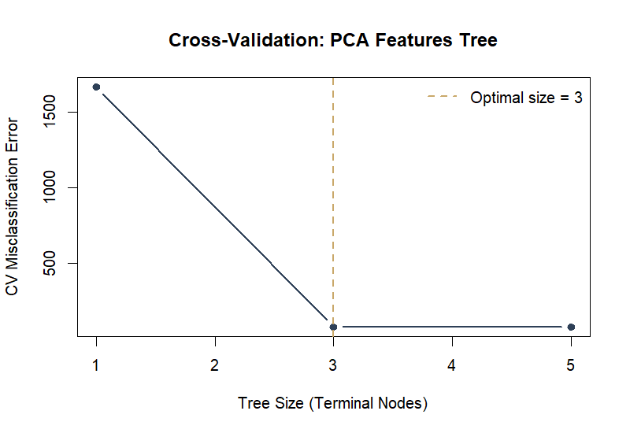
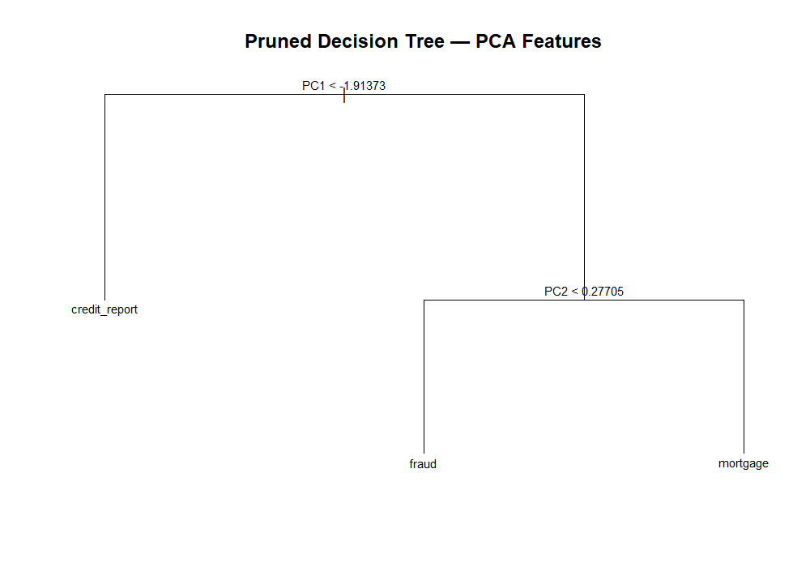
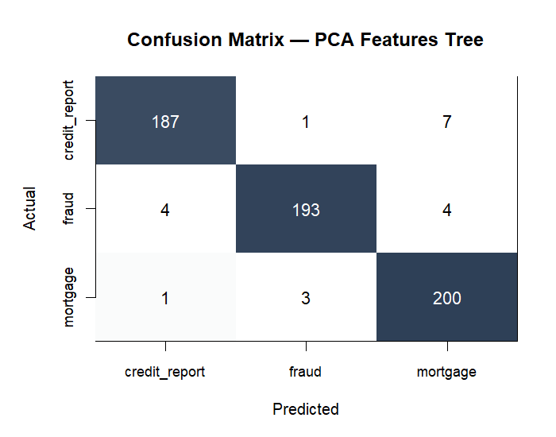
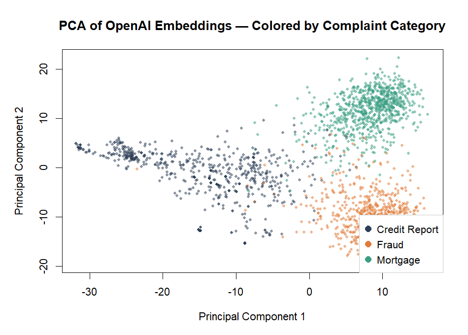

# CFPB Complaint Classification

This project classifies consumer financial complaints from the CFPB (Consumer Financial Protection Bureau) into one of three categories using OpenAI text embeddings and decision trees in R. The question is simple: given the text of a complaint, can a model figure out what it is about?

---

## Data

3,000 complaints, 1,000 per category:

| Category | Count | What these look like |
|---|---|---|
| `mortgage` | 1,000 | Escrow disputes, servicer issues, refinance problems |
| `credit_report` | 1,000 | Incorrect entries, identity disputes, FCRA violations |
| `fraud` | 1,000 | Unauthorized charges, account takeovers, scams |

Each complaint was passed through OpenAI's embedding model before this analysis. The model converts the raw text into a 1,536-dimensional numeric vector. The decision trees in this project train on those vectors, not on the raw text.

| | |
|---|---|
| Total complaints | 3,000 |
| Embedding dimensions | 1,536 |
| Average complaint length | 143 tokens |
| Min / Max tokens | 70 / 279 |

---

## Step 0: Word Cloud

A word cloud of the most common terms across all 3,000 complaints. CFPB redacts personal information with strings like XXXX, so those were removed along with standard English stopwords.

```r
corpus <- Corpus(VectorSource(CFPB$message))
corpus <- tm_map(corpus, content_transformer(tolower))
corpus <- tm_map(corpus, removePunctuation)
corpus <- tm_map(corpus, removeNumbers)
corpus <- tm_map(corpus, removeWords, stopwords("english"))
corpus <- tm_map(corpus, removeWords, c("xxxx", "xxx", "xx"))
corpus <- tm_map(corpus, stripWhitespace)
```



Words like *account*, *report*, *received*, and *told* come up a lot. They are generic enough to appear in all three complaint types, which is part of why a bag-of-words approach would not discriminate well between categories.

---

## Step 1: Decision Tree on Raw Embedding Features

The simplest approach: use all 1,536 embedding dimensions as features and train a decision tree directly on them. 80% of the data goes to training, 20% to testing.

```r
set.seed(1)
trainindex <- sample(nrow(CFPB), size = 0.8 * nrow(CFPB))
CFPB_train <- CFPB[trainindex, ]
CFPB_test  <- CFPB[-trainindex, ]

tree_model <- tree(issue ~ ., data = CFPB_train)
```

Cross-validation to find the right tree size, then prune:

```r
cv_results   <- cv.tree(tree_model, FUN = prune.misclass)
optimal_size <- cv_results$size[which.min(cv_results$dev)]
pruned_tree  <- prune.misclass(tree_model, best = optimal_size)
```







**Raw features tree results:**
- Overall error rate: **12.2%**
- Fraud miss rate: **20.9%** (about 1 in 5 fraud complaints get misclassified)

---

## Step 2: PCA, then Decision Tree

1,536 features is a lot of correlated dimensions for a single tree to work through. PCA compresses them into a smaller set of uncorrelated components. The cutoff used here is 50% of total variance explained.

```r
pca_result     <- prcomp(embedding_features, center = TRUE, scale = TRUE)
PVE            <- pca_result$sdev^2 / sum(pca_result$sdev^2)
num_components <- which(cumsum(PVE) >= 0.5)[1]  # 29 components
```



29 components get us to 50% of the variance. The tree then trains on those 29 features.

```r
train_pca <- data.frame(
  issue = CFPB_train$issue,
  pca_result$x[, 1:num_components]
)
tree_pca        <- tree(issue ~ ., data = train_pca)
pruned_tree_pca <- prune.misclass(tree_pca, best = optimal_size_pca)
```







**PCA tree results:**
- Overall error rate: **3.3%**
- Fraud miss rate: **4.0%** (about 1 in 25)

---

## Results

| Model | Overall Error | Fraud Miss Rate |
|---|---|---|
| Tree on raw embeddings (1,536 features) | 12.2% | 20.9% |
| Tree on PCA features (29 components) | **3.3%** | **4.0%** |

PCA reduces error by about 4x. With 1,536 correlated features, the tree wastes splits on noise. Reducing to 29 orthogonal components gives it cleaner signal to work with.

---

## PCA Scatter Plot

PC1 vs PC2, colored by complaint category. The three groups separate fairly well in this space, which explains why the PCA tree performs so much better.



---

## How to Reproduce

1. Clone the repo and place `CFPB_Complaints.csv` in the root directory.
2. Install packages:

```r
install.packages(c("tm", "wordcloud", "tree"))
```

3. Run `generate_charts.R` to save all plots, then `cfpb_classification.R` for the full analysis output.

**R version:** 4.3+

---

## Files

```
cfpb-complaint-classifier/
├── cfpb_classification.R     # full analysis
├── generate_charts.R         # saves charts as PNGs
├── charts/                   # chart output
│   ├── 01_wordcloud.png
│   ├── 02_cv_raw_tree.png
│   ├── 03_pruned_raw_tree.png
│   ├── 04_confusion_raw.png
│   ├── 05_pca_variance.png
│   ├── 06_cv_pca_tree.png
│   ├── 07_pruned_pca_tree.png
│   ├── 08_confusion_pca.png
│   └── 09_pca_scatter.png
└── README.md
```

`CFPB_Complaints.csv` is not in the repo (56 MB). The raw complaint data is publicly available through the CFPB complaint database.
